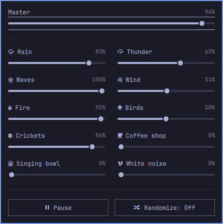

# Yuragi

**ゆらぎ · by nachfq for everyone**

An offline ambient sound mixer for Omarchy. Ten nature and background sounds,
independent volumes, gentle Play / Pause fades, and a mix that drifts with Randomize.

**[Installation](docs/INSTALLATION.md) · [Usage](docs/USAGE.md) · [Troubleshooting](docs/TROUBLESHOOTING.md) · [All docs](docs/README.md)**

Requires Omarchy 4 with Omarchy Shell and Qt Multimedia 6.11+ (native PipeWire).

## Support Yuragi

Enjoying Yuragi? **[Give it a ⭐ on GitHub](https://github.com/nachfq/omarchy-yuragi)**
— it helps others discover the project. Free and open source, for everyone.
[Bug reports](https://github.com/nachfq/omarchy-yuragi/issues) and
[contributions](docs/DEVELOPMENT.md) are welcome.

## Credits

[MIT code](LICENSE) · [Audio licenses and credits](SOUNDS_LICENSES.md)

Inspired by [A Soft Murmur](https://asoftmurmur.com/), independently built for
Omarchy. Thanks to the recording authors, Blanket’s contributors, and Omarchy.
